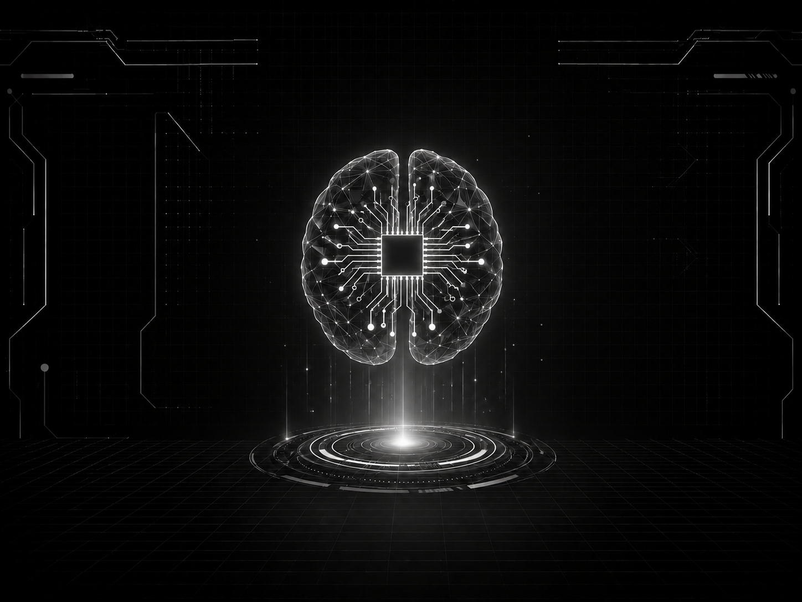
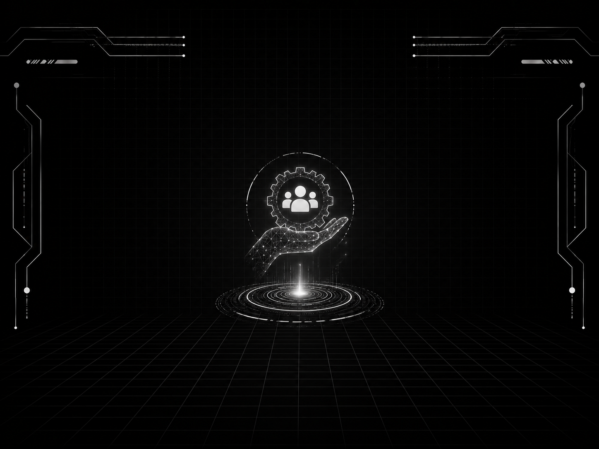
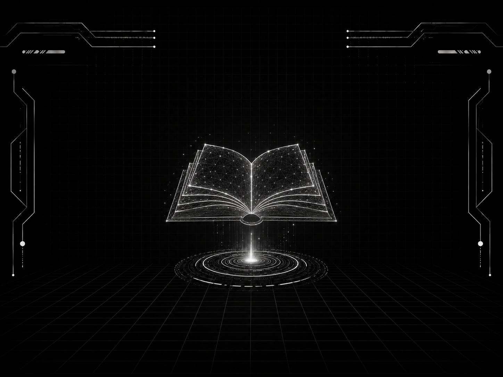
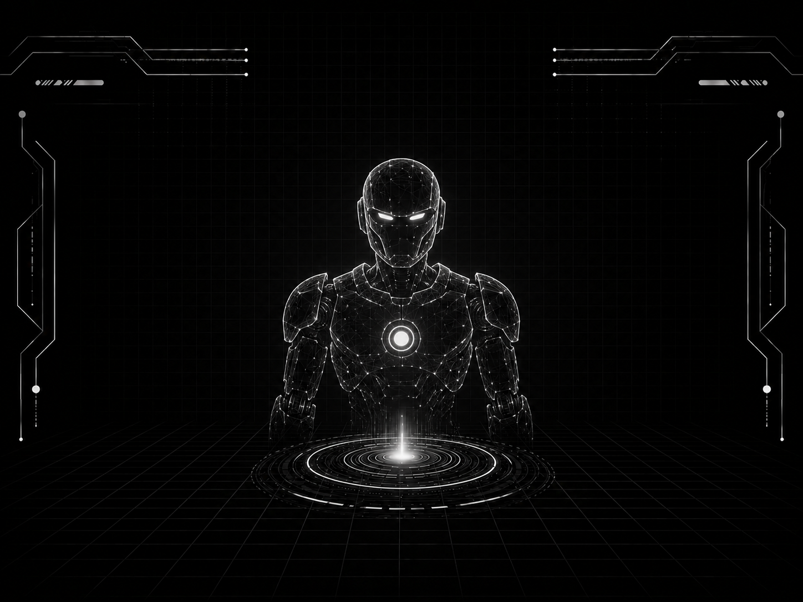

# Sasikumar's Developer Portfolio 🚀


Welcome to the repository for my personal developer portfolio! This project is a completely bespoke, highly interactive website built from the ground up using **Vanilla HTML, CSS, and JavaScript**. It serves as a comprehensive showcase of my skills, experiences, projects, and achievements as a Software Developer and AI Engineer.

It features a custom **Dark Holographic/HUD Glassmorphism** design language, complete with smooth animations, scroll reveals, and high-performance interactive elements that provide an immersive user experience.

## 🌟 Live Demo
Check out the live version of my portfolio here: **[https://sasikumar1630portfolio.vercel.app/](https://sasikumar1630portfolio.vercel.app/)**

---

## ✨ Key Features

- **Custom UI Architecture**: No CSS frameworks were used. Every component, from the glass cards to the hexagonal neon buttons, is styled purely with standard CSS3 properties (CSS Grid, Flexbox, CSS Variables).
- **Interactive Glassmorphism**: Heavily utilizes `backdrop-filter: blur()` and layered `rgba` backgrounds to achieve a translucent, high-tech HUD aesthetic.
- **Scroll Reveal Animations**: Elements elegantly fade and slide into view as the user scrolls down the page, utilizing the Intersection Observer API.
- **Dynamic Projects Gallery**: Features a built-in Javascript-powered modal lightbox system for viewing detailed case studies of my projects.
- **Fully Responsive**: The layout fluidly adapts to any screen size, seamlessly collapsing complex grid structures into scrollable mobile-friendly views.

## 📸 Screenshots

### About & Skills



### Services & Experience



### Projects & Achievements



### Contact


---

## 🛠️ Technology Stack

- **HTML5**: Semantic markup structuring the classic single-page application flow.
- **CSS3**: Variables, Flexbox, Grid, Pseudo-elements (`::before`, `::after`), Keyframes, and high-end aesthetic properties like `clip-path` and `backdrop-filter`.
- **Vanilla JavaScript (ES6)**: Powers the dynamic DOM manipulations, scroll listeners, modal systems, and form handling—zero heavy libraries like jQuery or React.
- **Devicon**: Utilized for the beautiful, vector-based technology stack icons.

## 🗂️ Project Structure
```text
├── index.html        # Main entry point and document structure
├── style.css         # All styling, variables, animations, and media queries
├── script.js         # Interactivity, modal handling, and scroll observers
├── certificates/     # Image assets for the achievement section
└── *.png / *.jpg     # Various background, screenshots and hero image assets
```

## 🚀 Running Locally

You can run this project locally by launching a local development server:

```bash
npx serve -l 3000
```
Then visit `http://localhost:3000` in your browser.

## 📬 Contact

- **LinkedIn**: [sasikumarsenthil](https://linkedin.com/in/sasikumarsenthil)
- **GitHub**: [sasikumar161106](https://github.com/sasikumar161106)
- **LeetCode**: [ssk_codes](https://leetcode.com/u/ssk_codes/)
- **Email**: sasikumarldrago@gmail.com

---

*Designed and developed by Sasikumar.*